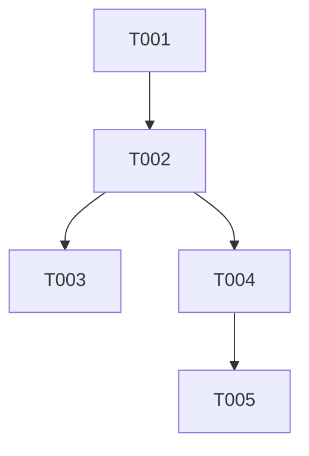

# Tasks: 个人中心头像自动补抓

**Input**: Design documents from `spec/profile-avatar-auto-retry/`
**Prerequisites**: plan.md, spec.md

**Organization**: 本 feature 为单文件修改，包含一个 P1 用户故事。测试遵循项目 AGENTS.md 规范。

## Format: `[ID] [P?] [Story] Description`

---

## Phase 1: Foundational (Blocking Prerequisites)

**Purpose**: 添加头像自动补抓逻辑的单元测试（先写测试，确保失败后再实现）

- [X] T001 [P] 添加 `ensureAvatarCached` 方法的单元测试到 `entry/src/test/AppState.test.ets`：覆盖已登录有缓存→不触发刷新、已登录无缓存→触发 `refreshUserInfo`、未登录→不做任何操作三种场景

**Checkpoint**: 测试已编写但预期失败（因实现尚未完成）

---

## Phase 2: User Story 1 - 进入「我的」标签页自动补抓头像 (Priority: P1) 🎯 MVP

**Goal**: 用户每次切换到「我的」标签时，若本地头像缓存缺失，自动通过 Pixiv API 获取并缓存头像

**Independent Test**: 登录后手动删除本地 `avatar_{userId}.jpg` 缓存文件 → 切换到「我的」标签 → 确认头像自动加载

### Implementation for User Story 1

- [X] T002 [US1] 在 `entry/src/main/ets/pages/setting/SettingPage.ets` 的 `aboutToAppear()` 中添加头像检查与自动补抓逻辑，新增私有异步方法 `checkAndRefetchAvatar()`，在本地缓存缺失时调用 `appState.refreshUserInfo()`

**Checkpoint**: 进入「我的」标签时，若本地无头像缓存，自动从 Pixiv API 获取并显示头像

---

## Phase 3: Polish & Cross-Cutting Concerns

**Purpose**: 同步更新项目文档

- [X] T003 [P] 在 `FEATURES.md` 中追加本功能的记录（功能编号、描述、涉及文件路径）

---

## Phase 4: Verification

<!-- verification_scope: build-only -->

**Purpose**: 构建验证 + 部署测试

- [X] T004 Build project and fix any compilation errors (invoke build_project; iterate fix → build until success)
- [X] T005 Deploy application to device/emulator (invoke start_app)

---

## 📊 Dependency Graph

## ⚡ Parallel Execution Guide

| Phase | Tasks | Required Files | Execution Notes |
|-------|-------|----------------|-----------------|
| Foundational | T001 | AppState.test.ets | 先写测试，后实现 |
| US1 | T002 | SettingPage.ets | 核心实现 |
| Polish | T003 | FEATURES.md | 可在 T002 完成后并行执行 |
| Verification | T004, T005 | 全量代码 | T002 完成后触发构建 |

## Implementation Strategy

### Single-Feature Execution

1. T001 (测试先行) → T002 (核心实现) → T003 (文档同步)
2. 构建验证 (T004 → T005)
3. 根据 AGENTS.md 规则 4，每次代码修改后自动执行 `hvigorw test` 和 `hvigorw assembleHap`

## Notes

- T001 和 T002 间存在严格依赖：先写测试再实现
- 所有异步操作静默失败，不阻塞 UI 渲染
- 仅修改两个文件：`SettingPage.ets`（核心逻辑）、`AppState.test.ets`（测试）
